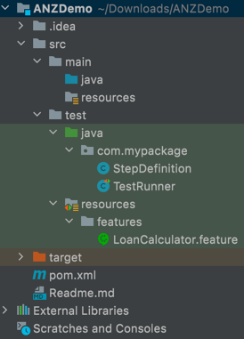

**ANZDemo : Home loan calculator app test**

ANZDemo is a behavior driven development (BDD) approach to write automation test script to test Home loan calculator app.
It enables you to write and execute automated acceptance tests.
Automate your test cases with minimal coding.

**Download a Framework:** 
Github - 

**Framework Architecture:**

src/test/resources/features - all the cucumber features files (files .feature ext) goes here.
src/test/java/com.mypackage - you can define step defintion under this package for your feature steps.
src/test/java/com.mypackage - this package contains cucumber runner (TestRunner.java) where you can configure your glue code location (step defintions).

**Writing a test:**
The cucumber features goes in the features library and should have the ".feature" extension.
You can start out by looking at features/my_first.feature.

#### **Running test:**

**Setup chrome driver:** This project currently supports chrome browser only
You need to download the chrome driver from the below site:
[https://chromedriver.chromium.org/downloads](https://chromedriver.chromium.org/downloads)
Make sure to download the correct version of the chrome driver.
For MAC: Paste the chrome driver to usr/local/bin folder and provide the necessary permission 
under Preferences/ Security & privacy.

Go to your project directory from terminal and hit following commands

mvn test (defualt will run on local chrome browser)
mvn test -Dcucumber.options="classpath:features/my_first.feature" to run specific feature.
mvn test -Dcucumber.options="–-plugin html:target/result-html" to generate a HTML report.
mvn test -Dcucumber.options="–-plugin json:target/result-json" to generate a JSON report.